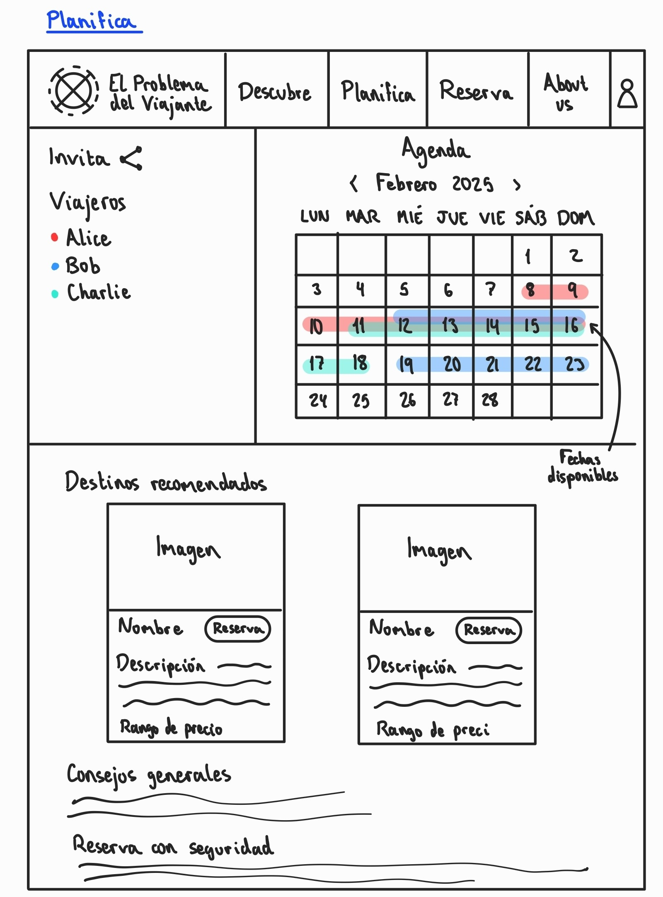
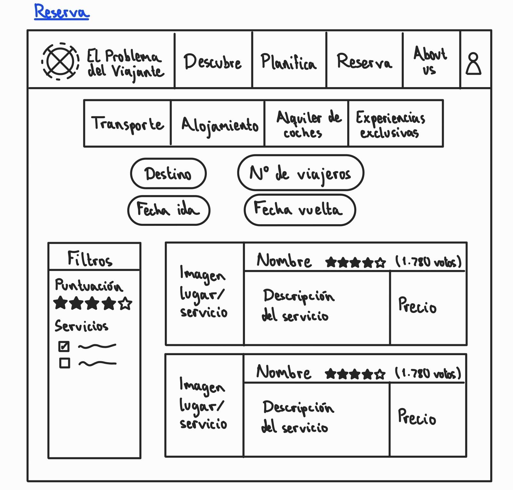
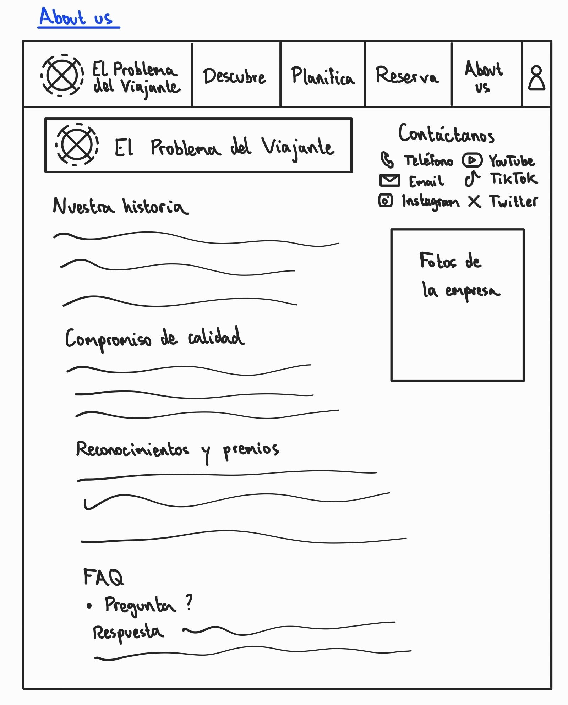

# *El problema del viajante*

Vamos a crear una agencia de viajes ficticia en la que se ofrecerán todo tipo de servicios relacionados con la planificación y la gestión de viajes, incluyendo transporte, alojamiento, lugares de interés para visitar, ocio, restauración, etc.

## Sitios en los que nos hemos inspirado
- [Experience travel group](https://experiencetravelgroup.com)
- [Booking](https://booking.com)
- [Tripadvisor](https://tripadvisor.es)
- [Skyscanner](https://skyscanner.es)
- [Google Calendar](https://calendar.google.com/calendar/u/0/r)

## Tormenta de ideas
- Reserva de hoteles.
- Reserva de aviones.
- Reserva de otros medios de transporte. En general, cómo ir al lugar desde donde estés tú.
- Lugares de interés para visitar, con su foto, web, ubicación, etc. 
- Lugares de ocio, restauración, y otro tipo de tiendas conocidas en la zona.
- Calendario con planificación del viaje, desde el que acceder a la información sobre el medio de transporte elegido, alojamiento, etc. y que permita organizar los lugares de visita de cada día.
- Lista de lugares y tiendas favoritos, junto a un mapa integrado en donde aparezcan destacados.
- Experiencias exclusivas, con planificaciones de viajes realizadas previamente por expertos.

**Otros elementos**:
- **Audiencia**: público genérico, ya que cada vez más personas viajan de forma relativamente habitual, y resulta de gran utilidad una página web desde la que poder gestionar todo el viaje.
- **Elementos visuales**: principalmente imágenes y vídeos de cada lugar, mapas. Logo generado con IA que sea característico de la empresa.
- **Financiación**: se podrían obtener beneficios a través de anuncios en la página. También se podría incluir un sistema de suscripción o mecenazgo con descuentos dentro de la página web, para clientes habituales.

## Inventario de contenido
- Presentación de la página
- Destinos de moda/recomendados
- Exploración (lugares menos conocidos, o aleatorios)
- About us: quiénes somos, nuestra historia, qué nos diferencia 
- Búsqueda de hoteles
- Búsqueda de medios de transporte (avión, tren, autobús, etc.)
- Lugares de visita, ocio, restauración, etc.
- Alquiler de coches
- Experiencias exclusivas
- Calendario para la planificación del viaje
- Mapa de lugares favoritos
- Newsletter con novedades
- FAQ
- Mecanismos de reserva con seguridad
- Seguro de viajes
- Consejos generales para viajes al extranjero
- Nuestro sistema de puntuación
- Experiencias exclusivas
- Opiniones de expertos 
- Certificados de calidad, premios
- Redes sociales
- Términos de uso, política de cookies, política de privacidad

## Arquitectura de información
Una vez disponemos del inventario de contenido, podemos organizar estos elementos jerárquicamente en una arquitectura de la información, que nos dará una primera aproximación al número de páquinas que necesitamos crear y al esquema de navegación que permite relacionarlas. 

Llegamos así, a alto nivel, a la siguiente estructura:
- Página principal: Presentación de la página que llame la atención, newsletter, valoraciones, opiniones de expertos.
- Descubre: búsqueda de lugares visita, ocio, restauración etc., destinos de moda/recomendados, exploración, mapa de lugares favoritos.
- Planifica: calendario, consejos generales para viajes al extranjero, seguro de viajes, mecanismos de reserva con seguridad.
- Reserva: Búsqueda de hoteles, búsqueda de aviones y otros medios de transporte, alquiler de coches, reserva de restaurantes, experiencias exclusivas.
- About us: quiénes somos, nuestra historia, qué nos diferencia, FAQ, redes sociales, nuestro sistema de puntuación, certificados de calidad, premios
- Términos de uso, política de cookies, política de privacidad

## Mapa de navegación
- Página principal: Presentación de la página que llame la atención, newsletter, opiniones de expertos.
- Reservas: Búsqueda de hoteles, búsqueda de aviones y otros medios de transporte, alquiler de coches, reserva de restaurantes, experiencias exclusivas.
- Destinos: búsqueda de lugares visita, ocio, restauración etc., destinos de moda/recomendados, exploración, mapa de lugares favoritos.
- Calendario de planificación: calendario, consejos generales para viajes al extranjero, seguro de viajes, mecanismos de reserva con seguridad.
- About us: quiénes somos, nuestra historia, qué nos diferencia, FAQ, redes sociales, nuestro sistema de puntuación, certificados de calidad, premios
- Términos de uso, política de cookies, política de privacidad

## Prototipo manual
A continuación se muestran los bocetos de las interfaces realizadas a mano. Dado el carácter académico de este documento, se considera relevante incluirlas, a pesar de que en un entorno profesional su uso sería poco común. Se han realizado los prototipos para cinvo ventanas de interés, que se comentan a continuación.

En esta figura se puede ver la página principal del sitio web. Aquí, se ve la barra de navegación global, que será común a todas las páginas, unos cuantos elementos visuales sobre algunos destinos destacados para captar la atención del visitante, un apartado de *newsletter* con novedades importantes y una sección con valoraciones de clientes.

Desde la barra de navegación, el usuario podrá registrarse por medio de correo electrónico para poder realizar valoraciones, que se guarden sus viajes, poder realizar planificación colaborativa y obtener mejores recomendaciones.

En el apartado de **Descubre** se pretende que los clientes de la página que no tienen todavía claro cuál es el destino del viaje que quieren hacer puedan explorar sus opciones. 

Se ve, en primer lugar, una barra de navegación secundaria en la que aparecen diferentes subsecciones. En cada una de estas se presentarán destinos asociados al criterio empleado. En todas estas aparecerán diversos paquetes de viajes, mostrando imágenes y descripciones de los lugares a los que viajar. Asimismo, se incluye un mapa interactivo en el que aparecerán destacados los lugares mencionados en las tarjetas que aparecen en la página. Interactuando con este mapa, el cliente podrá, además, filtrar la búsqueda a un destino en concreto. Se incluyen además algunos destinos recomendados, consejos generales para la planificación de viajes y un apartado sobre la seguridad en las reservas.

En la sección de **Planifica**, el cliente podrá planificar su viaje con, posiblemente, otros usuarios.

Así, están disponibles una columna en la que se puede invitar a otros viajeros y un calendario en el que cada uno de los participantes en un viaje puede marcar las fechas que tiene disponibles para una planificación más eficiente.

En la página de **Reserva** el usuario podrá gestionar las reservas necesarias para su viaje. Estas incluyen el transporte hasta el lugar, alojamiento, alquiler de vehículos y otras experiencias exclusivas facilitadas por nuestro sitio web.

Se incluye un filtro principal por destino, número de viajeros y fechas de ida y vuelta. Hay otros filtros secundarios que se podrán aplicar sobre la puntuación y el tipo de servicio. Una vez seleccionados estos campos, aparecerán los servicios recomendados por la web, con una imagen, su nombre, descripción y precio para que el usuario pueda gestionar su reserva.

La página de **About us** es principalmente de texto con información sobre la empresa ficticia. Hay información de contacto, la historia de la empresa, reconocimientos y premios, calidad y preguntas frecuentes (FAQ).

## Esqueleto digital

## Diseño final
La paleta de colores elegida ha sido [Catppuccin Latte](https://github.com/catppuccin/catppuccin/tree/main), mientras que la fuente que utilizaremos será Helvetica. Debido a que no está disponible en la herramienta utilizada para el diseño final, se ha usado una letra similar, Fira Sans.
 
## Storyboard

## Estructura de ficheros
Para la organización de los ficheros del proyecto, optamos por una estructura simple en directorios en la que el documento principal, 'index.html', está por sí solo en el nivel raíz, pues es lo que espera el servidor web. 

Por otra parte, tenemos un directorio con la documentación en el que se incluye este documento y sus imágenes asociadas en su correspondiente subdirectorio, así como otros elementos de documentación que puedan surgir en el futuro.

Para los contenidos en sí de la página web, disponemos de cuatro subdirectorios. Uno está destinado a almacenar todas las imágenes que serán necesarias para la elaboración del sitio web. Por otra parte, disponemos de una carpeta en la que se almacenarán los documentos HTML que darán estructura a las diferentes páginas. En el directorio de estilos se almacenarán los ficheros de CSS necesarios para dotar al sitio web de una apariencia profesional y consistente. Por último en el directorio de scripts se incluirán los ficheros de JavaScript que doten al sitio web de funcionalidades dinámicas. 

